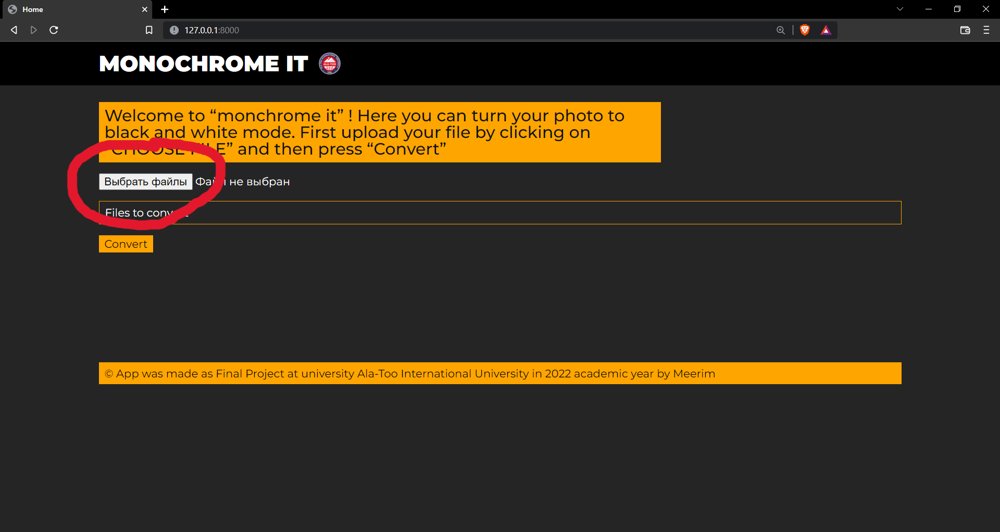
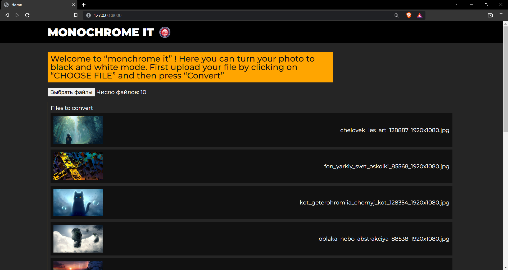
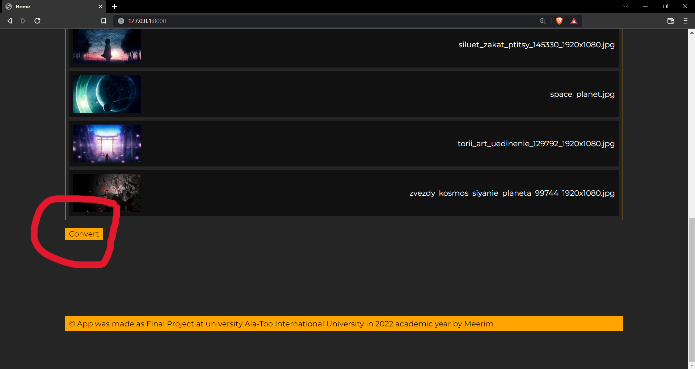
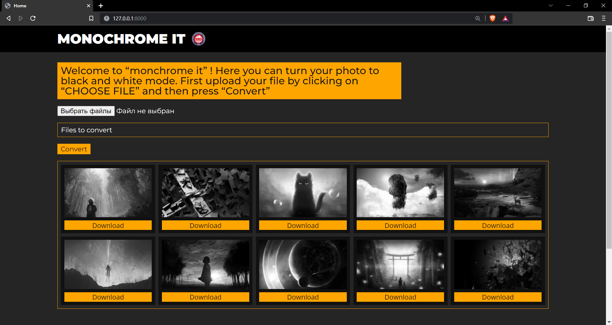

# **DISCRIPTION TO MONOCHROME PROJECT**
## This application allows you to quickly and efficiently process many files in monochrome style

# How it works ?
At the beginning, you need to select photos for processing by clicking on the "Select files" button

Next, you will see a list of files that will be processed

in order to continue, you need to click on the 'Convert' button. Next, the application will send the selected files to the server, where they will pass through the "batch it" function, and return to the user by storing the processed files on the server

also here you can the processed files